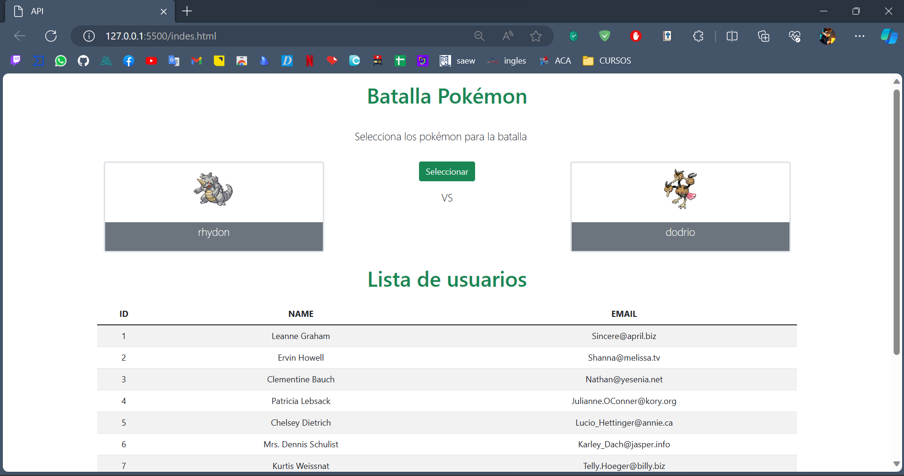

Este repositorio contiene un código HTML y JavaScript que implementa una interfaz web para una ver realizar un vs en una batalla pokemon y muestra una lista de usuarios obtenidos de una API. A continuación, se describen brevemente las características clave:

### Contenido del Repositorio:

- **index.html:** Define la estructura HTML para la página, incluyendo secciones para la batalla Pokémon y la lista de usuarios. Enlaza hojas de estilo y scripts de JavaScript.
- **datosUsers.js:** Contiene funciones para obtener datos de usuarios desde la API **`jsonplaceholder.typicode.com`** y mostrarlos en una tabla.
- **datosPokemon.js:** Implementa funciones para consultar la API **`pokeapi.co`** y mostrar detalles de Pokémon en la interfaz, así como para la selección aleatoria de Pokémon para la batalla.

### Uso:

1. Clona el repositorio.

```bash
bashCopy code
git clone https://github.com/JosephYM07/Pockemon-Api.git

```

1. Abre el archivo **`index.html`** en tu navegador.



